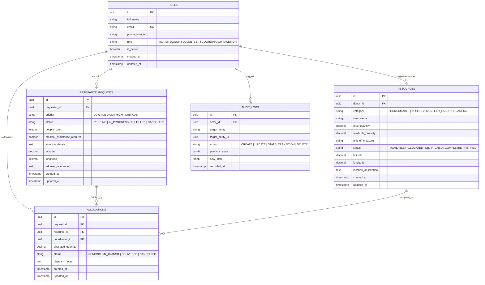

# Database Entity-Relationship Model (ERD)

## Overview

This schema documents the relational persistence model for the Share Help platform, enforcing domain invariants, RBAC boundaries, state-machine tracking, and audit trails.

